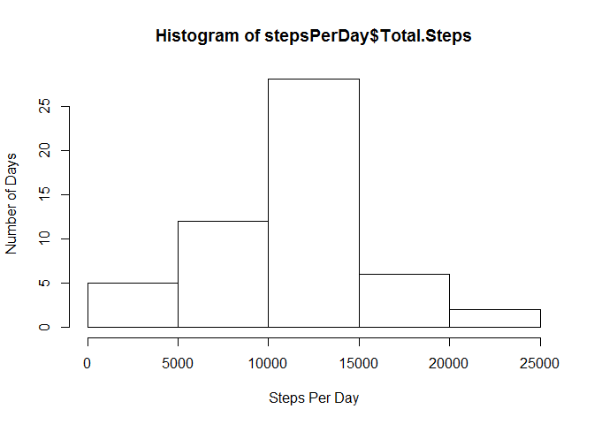

# Reproducible Research: Peer Assessment 1


## Loading and preprocessing the data


```r
library(data.table)

zipfile <- "activity.zip"
datafile <- "activity.csv"

setwd("~/RCode/Reproducable/RepData_PeerAssessment1/")

if(!file.exists(datafile))
{
     if(!file.exists(zipfile)) warning("Missing data files.")
     
     unzip(zipfile)
          
}

stepDataRaw <- read.csv(datafile)
```

## What is mean total number of steps taken per day?


```r
steps <- stepDataRaw[complete.cases(stepDataRaw),]
steps <- data.table(steps)
stepsPerDay <- steps[,sum(steps),by=date]
setnames(stepsPerDay, names(stepsPerDay), c("Date", "Total.Steps"))
hist(stepsPerDay$Total.Steps,xlab ="Steps Per Day", ylab="Number of Days")
```

 

## What is the average daily activity pattern?


## Imputing missing values


## Are there differences in activity patterns between weekdays and weekends?
