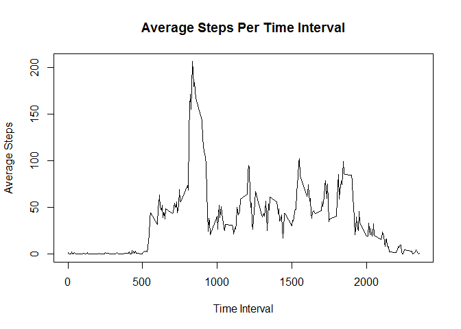
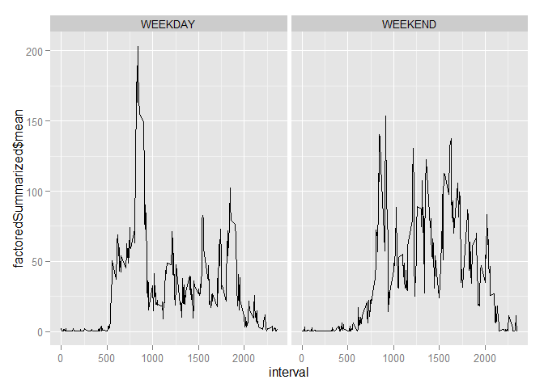

# Reproducible Research: Peer Assessment 1
Author: *instig888*  
Date: *6/13/2015*

## Before We Get Started Processing
I start by loading the required libraries.  In my version I have removed the
warning and error messages so that the library comments don't get woven into the
HTML ouptut.  They don't serve any real purpose in this case.  If you don't have
them installed you might not see errors as a result if Knitting this document.

```r
library(dplyr)
library(lubridate)
library(ggplot2)
library(data.table)
```

## Loading and preprocessing the data

```r
zipfile <- "activity.zip"
datafile <- "activity.csv"

setwd("~/RCode/Reproducable/RepData_PeerAssessment1/")

# See if the file has already been pulled from the Zip.
if(!file.exists(datafile))
{
     # If the file didn't exist do we have the zip file?
     # If not exit.
     if(!file.exists(zipfile)) stop("Missing data files.")
     
     unzip(zipfile)
}

# Read in the data in a raw format.  Don't convert the date strings to factors
# this makes it esaier to do some date manipulation later with lubridate.
stepDataRaw <- data.table(read.csv(datafile, stringsAsFactors=FALSE))

# In the first set of analysis we want to ignore the NAs. 
# Create a variable for only the complete cases of the data.
stepsComp <- stepDataRaw[complete.cases(stepDataRaw),]
```

## What is mean total number of steps taken per day?
Using the NA filtered data calculate and display the total number
of steps per day in a histogram.

```r
stepsComp <- data.table(stepsComp)
# Use dplyr to group the data by date and summarize on the sum of the steps
stepsPerDay <- summarize(group_by(stepsComp, date), sum(steps))
# Rename the columns for clarity
setNames(stepsPerDay, c("Date", "Total.Steps"))
```

```
## Source: local data table [53 x 2]
## 
##          Date Total.Steps
## 1  2012-10-02         126
## 2  2012-10-03       11352
## 3  2012-10-04       12116
## 4  2012-10-05       13294
## 5  2012-10-06       15420
## 6  2012-10-07       11015
## 7  2012-10-09       12811
## 8  2012-10-10        9900
## 9  2012-10-11       10304
## 10 2012-10-12       17382
## ..        ...         ...
```

```r
hist(stepsPerDay$Total.Steps,xlab ="Steps Per Day", ylab="Number of Days", main="Histogram with Complete Cases")
```

 

```r
# Named the variables with a number 1 so I can refer to them later for comparison
meanSteps1 <- as.integer(mean(stepsPerDay$Total.Steps))
medianSteps1 <- as.integer(median(stepsPerDay$Total.Steps))
```

### Mean and Median for this Data Set
Average Number of Steps Per Day: **10766**  
Median Number of Steps Per Day: **10765**

## What is the average daily activity pattern?
Make a time series plot (i.e. type = "l") of the 5-minute interval (x-axis) and the average number of steps taken, averaged across all days (y-axis)

Using the NA filtered data, we can group the data according to the specific time interval of a day and take the mean average of steps in that time interval across all days.

```r
## This time use dplyr to group by the interval and summarize on the averae steps
stepAveByInterval <- summarize(group_by(stepsComp, interval), mean(steps))
plot(stepAveByInterval$interval, stepAveByInterval$mean, type="l", xlab="Time Interval", ylab="Average Steps", main ="Average Steps Per Time Interval")
```

 

If we look at the Step Average By Interval data set, we can pick out which
interval has the highest (max) mean value.

```r
# Compare the max mean to the mean for each interval to find the index of the
# highest.  That's your max interval.
maxVector <- stepAveByInterval[(stepAveByInterval$mean == max(stepAveByInterval$mean)),]
```

The interval with the highest average is: **835**

## Imputing missing values
Note that there are a number of days/intervals where there are missing values (coded as NA). The presence of missing days may introduce bias into some calculations or summaries of the data.

Calculate and report the total number of missing values in the dataset (i.e. the total number of rows with NAs)

We can do this with the complete.cases or simply by checking is.na

```r
# When I loaded straight with read.csv I called it the RAW data
rawRows <- nrow(stepDataRaw)
# When I removed the NA rows with complete cases it was the COMP(LETE) data
completeRows <- nrow(stepsComp)
```

Raw data row count:  **17568**  
Number of NA Rows: **2304**

In order to remove some of the bias caused by the NA rows stated above we will modify the data set and replace the NA values with the average steps for the specific time interval from the larger data.


```r
# Create a vector indices of the NA data rows.
naRowIndices <- which(is.na(stepDataRaw$steps))

# Iterate throught the vector and replace the NAs
for(i in naRowIndices)
{
   # Determine what time interval we're fixing the NA for.     
   rawInterval <- stepDataRaw[i,3]
   # Pull the average steps from our earlier calculations for that interval
   # and update the raw data with the balancing data.
   stepDataRaw[i,1] <- stepAveByInterval[(stepAveByInterval$interval==rawInterval),2]
}

# Use dplyr as before to create the same summaries and calculations now that the
# NA data has been modified to help remove the bias of the NAs
newStepsPerDay <- summarize(group_by(stepDataRaw, date), sum(steps))
# Relabel the columns for clarity
setNames(newStepsPerDay, c("Date", "Total.Steps"))
```

```
## Source: local data table [61 x 2]
## 
##          Date Total.Steps
## 1  2012-10-01         576
## 2  2012-10-02         126
## 3  2012-10-03       11352
## 4  2012-10-04       12116
## 5  2012-10-05       13294
## 6  2012-10-06       15420
## 7  2012-10-07       11015
## 8  2012-10-08         576
## 9  2012-10-09       12811
## 10 2012-10-10        9900
## ..        ...         ...
```

```r
hist(newStepsPerDay$Total.Steps,xlab ="Steps Per Day", ylab="Number of Days", main="Histogram with imputed data")
```

 

```r
meanSteps2 <- as.integer(mean(newStepsPerDay$Total.Steps))
medianSteps2 <- as.integer(median(newStepsPerDay$Total.Steps))
```

### Mean and median of the total number of steps taken per day
Average Number of Steps Per Day (accounting for bias): **9429**  
Median Number of Steps Per Day (accounting for bias): **10395**

*Average Number of Steps Per Day (ORIGINAL): **10766***   
*Median Number of Steps Per Day (ORIGINAL): **10765***


## Are there differences in activity patterns between weekdays and weekends?

Create a new factor variable in the dataset with two levels - "weekday" and "weekend" indicating whether a given date is a weekday or weekend day.

```r
factoredData <- mutate(stepDataRaw, newdate=as.factor(ifelse(wday(strptime(date,"%Y-%m-%d")) %in% 2:6, "WEEKDAY", "WEEKEND")))

factoredSummarized <- summarize(group_by(factoredData, newdate, interval), mean(steps))
ggplot() + geom_line(data=factoredSummarized, aes(x=interval, y=factoredSummarized$mean)) + facet_grid(. ~ newdate)
```

 
