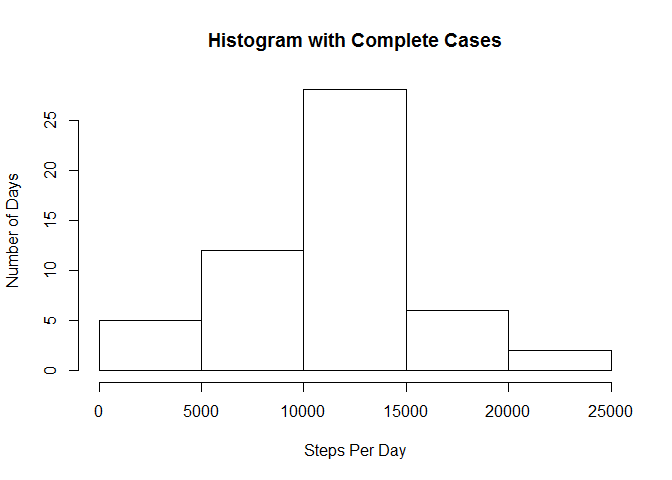
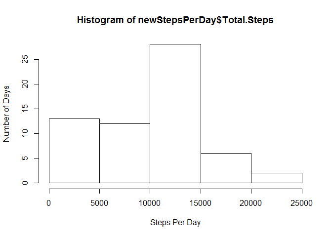
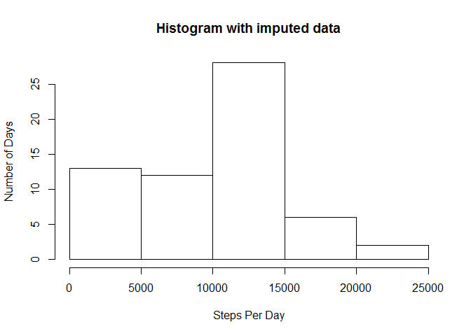

# Reproducible Research: Peer Assessment 1


## Loading and preprocessing the data


```r
library(data.table)
library(dplyr)
```

```
## 
## Attaching package: 'dplyr'
## 
## The following objects are masked from 'package:data.table':
## 
##     between, last
## 
## The following object is masked from 'package:stats':
## 
##     filter
## 
## The following objects are masked from 'package:base':
## 
##     intersect, setdiff, setequal, union
```

```r
library(lubridate)
```

```
## 
## Attaching package: 'lubridate'
## 
## The following objects are masked from 'package:data.table':
## 
##     hour, mday, month, quarter, wday, week, yday, year
```

```r
library(lattice)
library(ggplot2)

zipfile <- "activity.zip"
datafile <- "activity.csv"

setwd("~/RCode/Reproducable/RepData_PeerAssessment1/")

if(!file.exists(datafile))
{
     if(!file.exists(zipfile)) warning("Missing data files.")
     
     unzip(zipfile)
          
}

stepDataRaw <- read.csv(datafile, stringsAsFactors=FALSE)

## Create a variable for only the complete cases of the data.
stepsComp <- stepDataRaw[complete.cases(stepDataRaw),]
```

## What is mean total number of steps taken per day?


```r
stepsComp <- stepDataRaw[complete.cases(stepDataRaw),]
stepsComp <- data.table(stepsComp)
stepsPerDay <- summarize(group_by(stepsComp, date), sum(steps))
setnames(stepsPerDay, names(stepsPerDay), c("Date", "Total.Steps"))
hist(stepsPerDay$Total.Steps,xlab ="Steps Per Day", ylab="Number of Days")
```

 

```r
meanSteps1 <- as.integer(mean(stepsPerDay$Total.Steps))
medianSteps1 <- as.integer(median(stepsPerDay$Total.Steps))
```

### Mean and median of the total number of steps taken per day
Average Number of Steps Per Day: 10766  
Median Number of Steps Per Day: 10765

## What is the average daily activity pattern?
Make a time series plot (i.e. type = "l") of the 5-minute interval (x-axis) and the average number of steps taken, averaged across all days (y-axis)


```r
stepAveByInterval <- summarize(group_by(stepsComp, interval), mean(steps))
plot(stepAveByInterval$interval, stepAveByInterval$mean, type="l", xlab="Time Interval", ylab="Average Steps", main ="Average Steps Per Time Interval")
```

 

Which 5-minute interval, on average across all the days in the dataset, contains the maximum number of steps?

```r
maxVector <- stepAveByInterval[(stepAveByInterval$mean == max(stepAveByInterval$mean)),]
```

The interval with the highest average is: 835


## Imputing missing values
Note that there are a number of days/intervals where there are missing values (coded as NA). The presence of missing days may introduce bias into some calculations or summaries of the data.

Calculate and report the total number of missing values in the dataset (i.e. the total number of rows with NAs)

We can do this with the complete.cases or simply by checking is.na

```r
rawRows <- nrow(stepDataRaw)
completeRows <- nrow(stepsComp)
```

Raw data row count:  17568  
Number of NA Rows: 2304

In order to remove some of the bias caused by the NA rows stated above we will modify the data set and replace the NA values with the average steps for the specific time interval from the larger data.


```r
naRowIndices <- which(is.na(stepDataRaw$steps))

for(i in naRowIndices)
{
   rawInterval <- stepDataRaw[i,3]
   stepDataRaw[i,1] <- stepAveByInterval[(stepAveByInterval$interval==rawInterval),2]
}


newStepsPerDay <- summarize(group_by(stepDataRaw, date), sum(steps))
setnames(newStepsPerDay, names(newStepsPerDay), c("Date", "Total.Steps"))
hist(newStepsPerDay$Total.Steps,xlab ="Steps Per Day", ylab="Number of Days")
```

 

```r
meanSteps2 <- as.integer(mean(newStepsPerDay$Total.Steps))
medianSteps2 <- as.integer(median(newStepsPerDay$Total.Steps))
```

### Mean and median of the total number of steps taken per day
Average Number of Steps Per Day (accounting for bias): 9429  
Median Number of Steps Per Day (accounting for bias): 10395

*Average Number of Steps Per Day (ORIGINAL): 10766*   
*Median Number of Steps Per Day (ORIGINAL): 10765*


## Are there differences in activity patterns between weekdays and weekends?

Create a new factor variable in the dataset with two levels - "weekday" and "weekend" indicating whether a given date is a weekday or weekend day.

```r
factoredData <- mutate(stepDataRaw, newdate=as.factor(ifelse(wday(strptime(date,"%Y-%m-%d")) %in% 2:6, "WEEKDAY", "WEEKEND")))

# ggplot() + geom_line(data=factoredData, aes(x=interval, y=steps)) + facet_grid(. ~ newdate)

factoredSummarized <- summarize(group_by(factoredData, newdate, interval), mean(steps))
ggplot() + geom_line(data=factoredSummarized, aes(x=interval, y=factoredSummarized$mean)) + facet_grid(. ~ newdate)
```

 
